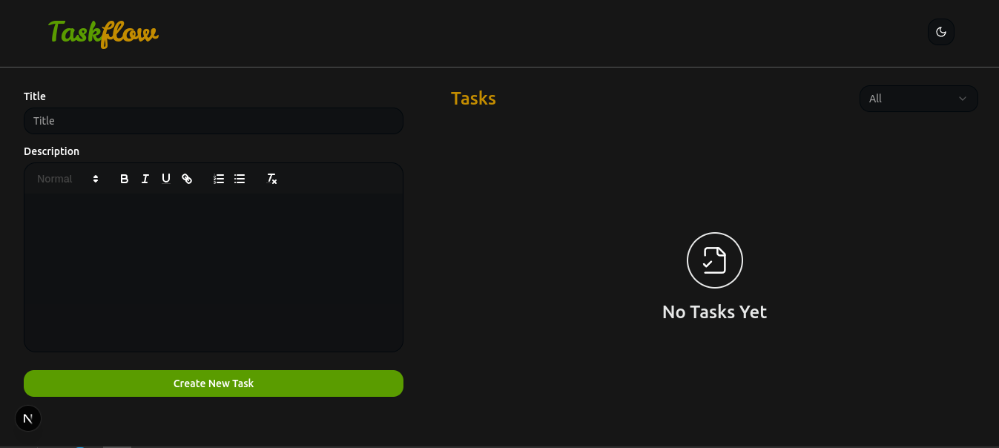

# Task Flow

This is a **Task Flow Application** built with a **Next.js** frontend and a **Node.js + Express.js** backend. It provides a simple and efficient way to manage tasks with CRUD (Create, Read, Update, Delete) operations.

## Live Demo

You can view the live version of the application at:

[Live URL](https://task-flow-1.vercel.app/)

## Features

- **Create Task:** Add new tasks with a title and description.

- **Read Tasks:** Retrieve and display a list of all tasks.

- **Update Task:** Edit and update existing task details (e.g., mark as completed).

- **Delete Task:** Remove tasks from the system.

- **Error Handling:** Proper HTTP status codes and validation messages.

- **Data Persistence:** Store tasks using **MongoDB** as the database.

## Tech Stack

### Frontend:

- **Next.js** (Latest Version)

- **TailwindCSS**

- **TypeScript**

### Backend:

- **Node.js**

- **Express.js**

- **TypeScript**

- **MongoDB**

- **Mongoose**

## Screenshots



## Folder Structure

```

task-flow/

│── server/   # Backend (Node.js + Express + TypeScript + MongoDB)

│── client/   # Frontend (Next.js + TailwindCSS + TypeScript)

│── README.md

```

## API Endpoints

### Get All Tasks

```bash
GET api/tasks
```

#### Response:

```json
[
  {
    "id": 1,
    "title": "Buy groceries",
    "description": "Milk, eggs, and bread",
    "completed": false
  }
]
```

### Create a New Task

```bash
POST api/tasks
```

#### Request Body:

```json
{
  "title": "Read a book",
  "description": "Finish reading the novel",
  "completed": false
}
```

#### Response:

```json
{
  "id": 2,
  "title": "Read a book",
  "description": "Finish reading the novel",
  "completed": false
}
```

### Update a Task

```bash
PUT api/tasks/:id
```

#### Request Body:

```json
{
  "completed": true
}
```

#### Response:

```json
{
  "id": 2,
  "title": "Read a book",
  "description": "Finish reading the novel",
  "completed": true
}
```

### Delete a Task

```bash
DELETE api/tasks/:id
```

#### Response:

```json
{
  "message": "Task deleted successfully"
}
```

## Getting Started

Follow the instructions below to set up the project locally.

### Prerequisites

Make sure you have the following installed:

- [Node.js](https://nodejs.org/) (v14.x or higher)
- [npm](https://www.npmjs.com/)

### Installation

#### 1. Clone the repository

```bash

git clone <repository-url>

cd task-flow

```

#### 2. Setup the backend (server)

```bash

cd server

npm install

```

#### 3. Configure environment variables

- Create a `.env` file inside the `server/` folder

- Add the following:

  ```env

  PORT = 3001

  MONGODB_URI=<your-mongodb-uri>

  DEV_MONGODB_URI=<your-dev-mongodb-uri>

  ```

#### 4. Start the backend server

```bash

npm run dev

```

The backend will run on `http://localhost:3001`

#### 5. Setup the frontend (client)

```bash

cd ../client

npm install

```

#### 3. Configure environment variables

- Create a `.env` file inside the `server/` folder

- Add the following:

  ```env

  NEXT_PUBLIC_API_URL=http://localhost:3001/api

  ```

#### 6. Start the frontend server

```bash

npm run dev

```

The frontend will be available at `http://localhost:3000`

## Testing the API

### Using Postman

1. Open Postman and enter the API URL (e.g., `http://localhost:3001/tasks`).
2. Select the request type (GET, POST, PUT, DELETE).
3. Provide request parameters or body as needed.
4. Click **Send** and review the response.
